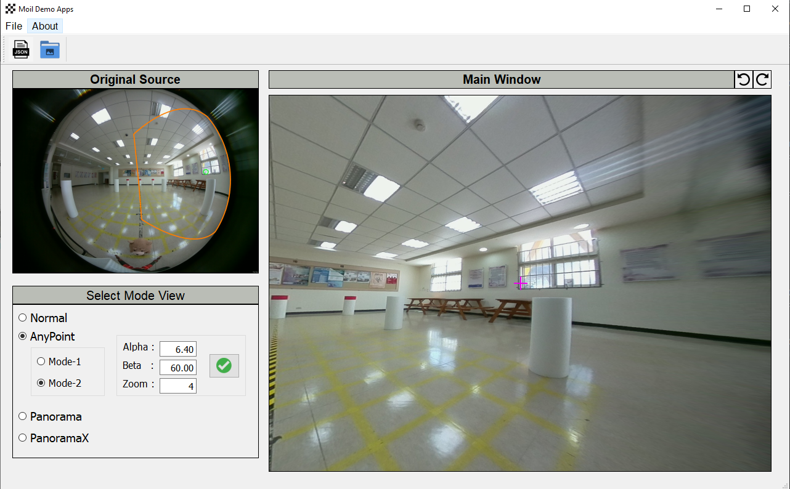

## Moil-Demo Apps

This application is to practice usage [Moildev library](https://github.com/MoilOrg/moildev) in advanced fisheye image processing. The GUI with dynamic size with keep ratio of the image. following branch anto112, the step to running this application is here:

1. Clone this repository

   you can directly download the zip file from this [link](https://github.com/MoilOrg/Demo-Apps-Moildev) 

   or using git command:

   ```
   $ git clone https://github.com/MoilOrg/Demo-Apps-Moildev.git --branch=anto112
   ```

2. Go to directory

   ```
   $ cd Demo-Apps-Moildev
   ```

3. Install requirement following this command:

   ```
   $ pip install -r requirements.txt
   ```

3. Run the apps:

   ```
   $ python src/main.py
   ```

   

**Example Result:**

- **Anypoint**

  - mode-2

    

  - mode-2

    

    

- **Panorama**


***--Thank you--***