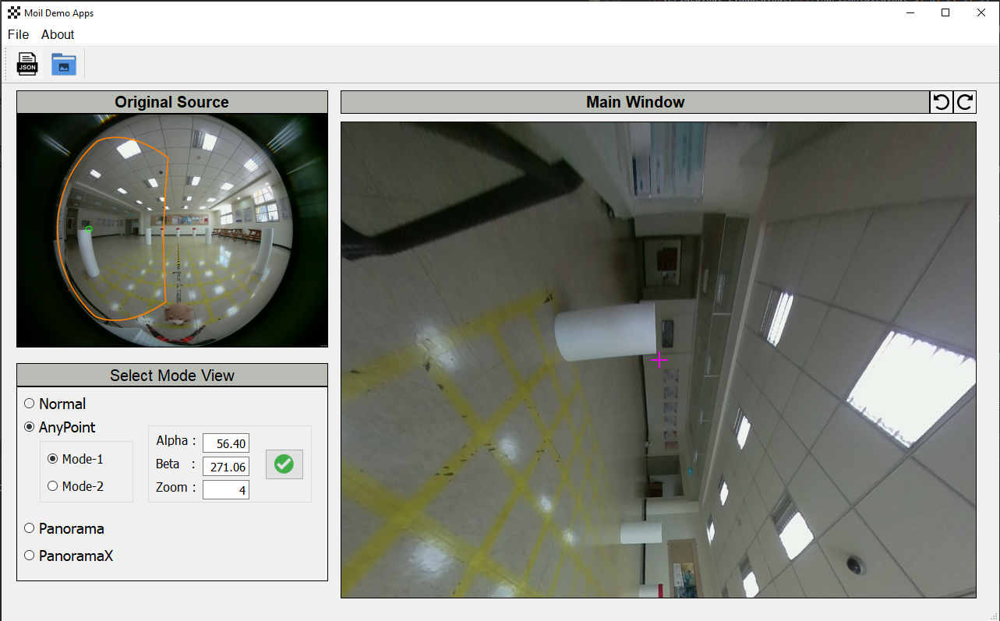

## Moil-Demo Apps

This application is to practice usage [Moildev library](https://github.com/MoilOrg/moildev) in advanced fisheye image processing.

1. Clone this repository

```
$ git clone https://github.com/anto112/moil-demo-apps.git
```

2. Install requirement following this command:

```
$ pip install -r requirements.txt
```

3. Run the apps:

```
$ python main.py
```

**Example:**

- **Anypoint**

  - mode-1

    

  - mode-2

    

    

- **Panorama**


